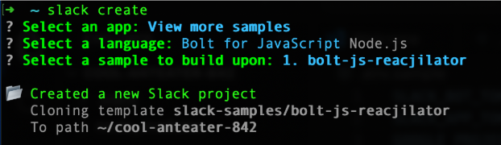

PRerequisites:
- Terminal (I'm using a mac for this, if you're using windows, the terminal/powershell process will likely be a little different)
- Slack CLI
- An IDE of your choice (I'm using Visual Studio Code)

## 1.Slack CLI - Bolt

```
slack create

```



I'm using the bolt-js-reacjilator sample for this project. It's a great one to check out on its own and made this project a lot quicker to spin up.

## 2. Add DeepL API Key
1. Change `env.sample` to `.env` (don’t forget to add this file to your gitignore!)
2. Add your DeepL Access token: `DEEPL_AUTH_KEY=ACCESS_TOKEN`  

## 3. Create your new Slack app in the API
1. Log in to your Slack workspace or join the Developer Program to get a free enterprise sandbox.
2. Open Your Apps dashboard.
3. Click Create New App > From Manifest
Copy the [manifest.yml](../manifest.yml) from the app you created in step 1 paste it into the form
4. Create app!

## 4. Tokens
1. In the Slack API, generate an App level token with the App-Level tokens interface under general. 
1. Copy that token and put it into your .env file:
```
SLACK_SIGNING_SECRET={your-app-signing-secret}
SLACK_APP_TOKEN={your-app-token-xapp-1234}
SLACK_BOT_TOKEN={your-bot-token-xoxb-1234}
DEEPL_AUTH_KEY={your-deepl-token-from-step2}
PORT=3000
```
You'll find the signing secret under Basic information in the Slack API. 

The app level token is also under Basic information. You'll go to generate token (connections:write enough for now) and after generating it copy it to paste in the .env file

Next, you'll need to set up your OAuth & Permissions. TO do this, go to your terminal and install your app to the workspace.

After you've installed your app to your workspace, you'll go back to the Slack API and copy the Bot User OAuth Token

## 5. Go to the Code!
For this, I wanted to use DeepL as my translator API. So even though the base sample uses the Google translator, DeepL tends to have better translations. I had to grab a list of supported langs from DeepL and then correlate to the Matching ISO 639-1 language code. 

[DeepL translation target languages](https://developers.deepl.com/docs/getting-started/supported-languages#translation-target-languages)

Using the langcode file because emojis based on flag works for this project. (emoji reacts are `:flag-country:`)

STRETCH GOAL - ask the user which language they want from a country if there’s more than one e.g. Afghanistan that usees both Pashto and Dari
